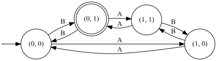

# Automatty

A lightweight library that implements automata with the Scala3 compiler (Dotty). 

Related to ENSEIRB-MATMECA module IF114: "Finite automata and applications".

Note: This project is under construction.

## Example:

```scala
import com.automatty.implicits._
import com.automatty.automata._
import com.automatty.automata.states._

trait Alphabet
case object A extends Alphabet
case object B extends Alphabet

// Automata that check if there is an even number of A and an odd number of B
val s00 = new State("(0, 0)") with InitialState
val s01 = new State("(0, 1)") with AcceptorState
val s10 = new State("(1, 0)")
val s11 = new State("(1, 1)")
val automaton = FiniteAutomaton.Complete[Alphabet, Nothing](
  s00,
  Set(s01, s10, s11),
  Set(
    s00--B->s01,
    s00--A->s10,
    s01--B->s00,
    s01--A->s11,
    s11--B->s10,
    s11--A->s01,
    s10--B->s11,
    s10--A->s00
  )
)

automaton.accepts(List(A, B, A)) // returns True
```

It is also possible to generate the rendering of automata with the render method `automaton.render('automata.png')`.



## sbt project compiled with Scala 3

### Usage

This is a normal sbt project. You can compile code with `sbt compile`, run it with `sbt run`, test it with `sbt test`, and `sbt console` will start a Scala 3 REPL.

For more information on the sbt-dotty plugin, see the
[dotty-example-project](https://github.com/lampepfl/dotty-example-project/blob/master/README.md).
